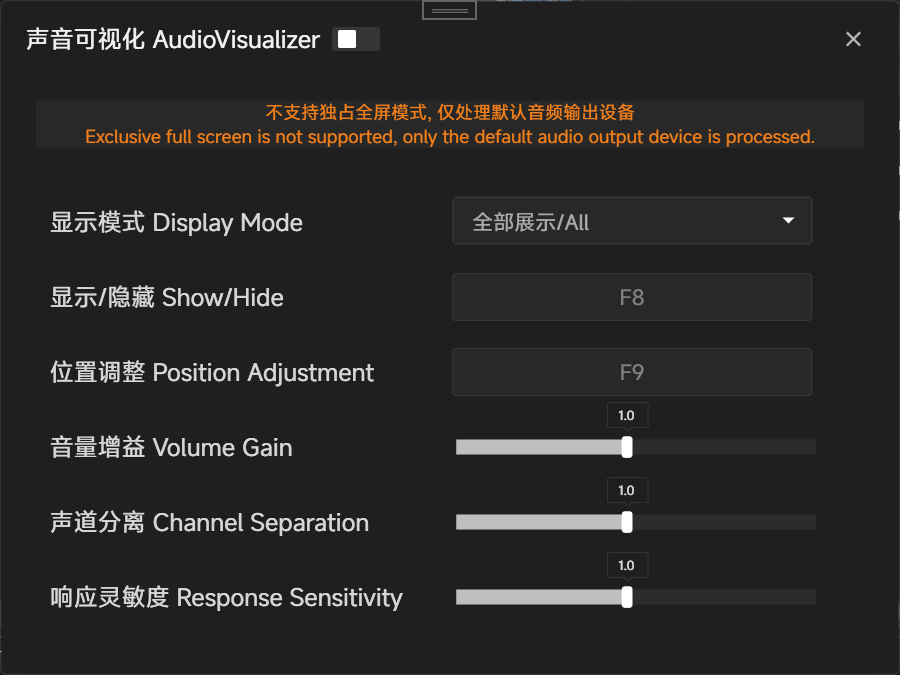

## Game Audio Direction Indicator for Deaf Players​

### Description:​​

This tool is designed to assist deaf or hard-of-hearing gamers by visually indicating the direction of in-game sounds. By analyzing stereo audio output (left/right channels), it provides real-time directional cues—such as arrows, indicators, or vibrations—to help players detect enemy movements, environmental hazards, and other critical audio cues in games.

### ​Key Features:​​

​Directional Visualization:​​ Displays left/right sound sources clearly (e.g., via on-screen arrows or color-coded alerts).
​Real-Time Feedback:​​ Instantly reacts to in-game audio for fast-paced gameplay.
​Customizable Alerts:​​ Adjustable sensitivity and visual/haptic feedback options.
​Low Latency:​​ Minimal delay to ensure competitive usability.
​Compatibility:​​ Works with most games that support stereo audio output.
​Purpose:​​
Bridges the accessibility gap in gaming by translating essential audio information into visual or tactile feedback, empowering deaf players to react dynamically to in-game events.

### Screenshots:

